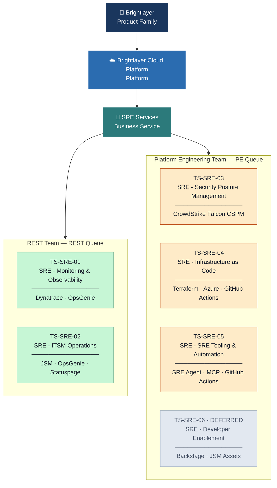

# JSM Assets Taxonomy Proposal - SRE Organization

## 1) Hierarchy Placement

| Level | Value |
|---|---|
| Product Family | Brightlayer |
| Platform | Brightlayer Cloud Platform |
| Business Service | SRE Services |

| Note Type | Guidance |
|---|---|
| Scope Boundary | Keep this SRE taxonomy separate from Fiji product taxonomy |
| Placement Rule | Do not nest SRE technical services under Remote Monitoring Platform (Fiji) |

---

## 2) Business Service Definition

| Field | Value |
|---|---|
| CI Type | Business Service |
| Name | SRE Services |
| Description | Platform reliability, operations, and engineering services provided by the SRE organization to Brightlayer platform and software product teams |
| Parent Platform | Brightlayer Cloud Platform |
| Owning Team | SRE Manager |

---

## 3) Technical Services - REST Team

| ID | Technical Service | Description | Owning Team | Queue | Primary Tools |
|---|---|---|---|---|---|
| TS-SRE-01 | SRE - Monitoring and Observability | Observability coverage, SLO lifecycle, synthetic monitoring, alert engineering, Davis AI tuning, DQL-backed SLI definitions | REST | REST Queue | Dynatrace, OpsGenie |
| TS-SRE-02 | SRE - ITSM Operations | Incident, problem, and change management operations; on-call coordination; escalations to product owning teams via JSM Assets | REST | REST Queue | JSM, OpsGenie, Statuspage |

---

## 4) Technical Services - Platform Engineering Team

| ID | Technical Service | Description | Owning Team | Queue | Primary Tools |
|---|---|---|---|---|---|
| TS-SRE-03 | SRE - Security Posture Management | Cloud posture management, CSPM triage, and remediation SLA enforcement (Critical <= 48 hours, High <= 7 days) | Platform Engineering | PE Queue | CrowdStrike Falcon CSPM |
| TS-SRE-04 | SRE - Infrastructure as Code | Terraform-based infrastructure provisioning, drift remediation, module lifecycle, and environment standardization | Platform Engineering | PE Queue | Terraform, Azure, GitHub Actions |
| TS-SRE-05 | SRE - SRE Tooling and Automation | Runbook automation, operational tooling, PIR tooling, toil-reduction engineering, and Brightlayer SRE Agent capabilities for context retrieval, triage support, and automation requests from product teams | Platform Engineering | PE Queue | Brightlayer SRE Agent, GitHub Copilot, MCP, GitHub Actions, PowerShell, Bash, Jira Software |
| TS-SRE-06 | SRE - Developer Enablement | Future-state enablement service for self-service reliability workflows and golden paths; defined now, activated when Backstage resumes | Platform Engineering | PE Queue | Backstage (deferred), JSM Assets |

---

## 5) Queue Routing Model

| Queue | Routed Services | Ticket Types |
|---|---|---|
| REST Queue | TS-SRE-01, TS-SRE-02 | Incidents, change records, monitoring service requests |
| PE Queue | TS-SRE-03 through TS-SRE-06 | Engineering requests, platform changes, automation requests, security remediation work |

---

## 6) Naming and Modeling Standards

| Category | Standard |
|---|---|
| Technical Service Naming | SRE - Service Name |
| ID Convention | TS-SRE-01 through TS-SRE-06 |
| Service Type Rule | Business Service = SRE offering; Technical Service = reusable capability owned by a team |
| Exclusion Rule | Infrastructure and external providers are Configuration Items, not Technical Services |
| Backstage Rule | Backstage capability is modeled but operationally deferred |

---

## 7) Governance Decisions Captured

| Decision Area | Outcome |
|---|---|
| Taxonomy Baseline | Greenfield |
| Team Model | One Business Service with two team-aligned technical service groups |
| Queue Design | Team-level queues (REST Queue, PE Queue) |
| ITSM Granularity in REST | Single technical service for incident/problem/change |
| CI/CD and GitOps Scope | Product/release team responsibility (not modeled as SRE technical service) |

---

## 8) Visual Taxonomy Map

> Renders in VS Code Markdown Preview and GitHub. To use in Miro: open a Miro board → **Insert** → **Mermaid** → paste the code block below.

